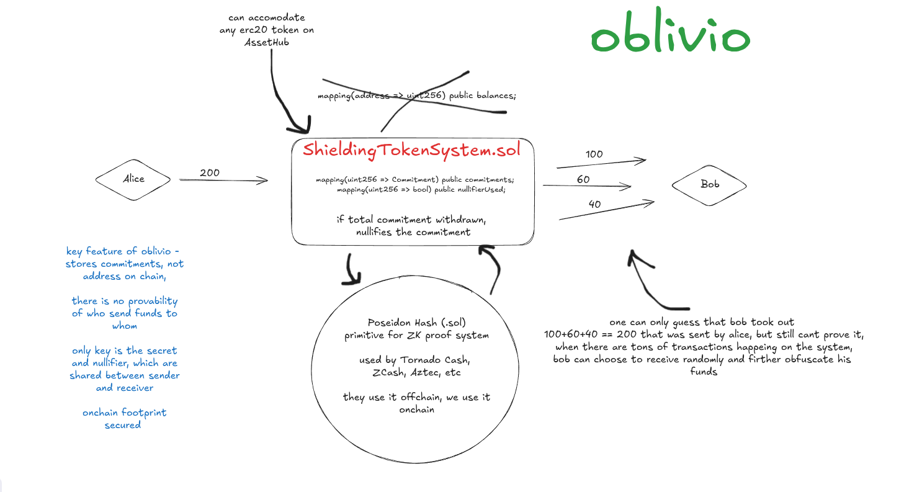

# 🛡️ Oblivio: Privacy-First Tokens on Polkadot

> **Breaking the chain of visibility** - Bringing true financial privacy to the Polkadot ecosystem with cutting-edge cryptographic primitives.



[](https://polkadot.network/)
[](https://polkadot.network/)
[](https://soliditylang.org/)

---

## 🎯 **What is Oblivio?**

Oblivio is a **privacy-preserving token system** that brings transactional privacy to Polkadot AssetHub. At its heart lies the first practical, gas-optimized implementation of the **Poseidon hash function** in pure Solidity, onchain—a breakthrough that is brought by PolkaVM.

### 💡 **The Problem We Solve**

Traditional blockchain transactions are **completely transparent**—every transfer, balance, and interaction is visible to anyone. This creates serious privacy concerns for:
- 🏢 **Enterprises** conducting confidential business
- 👥 **Individuals** seeking financial privacy
- 🔒 **DeFi protocols** requiring confidential operations

### 🚀 **Our Solution**

Oblivio introduces **cryptographic privacy primitives** that allow users to:
- ✅ Make transactions without revealing amounts
- ✅ Hide recipient addresses from public view
- ✅ Maintain transaction unlinkability
- ✅ Preserve full compatibility with existing Polkadot infrastructure

---

## 🏗️ **Architecture Overview**

### 🔐 **Core: Poseidon Hash Function**

O(`Poseidon.sol`) :

```solidity
// Generate privacy-preserving commitments
bytes32 commitment = bytes32(poseidon.poseidon(
    uint256(uint160(recipient)), 
    amount
));
```

#📍 Deployed on Paseo Asset Hub:** `0x7967cedEF3E09B4DcBD9b3a73f64cd53EE4b69B6`

#### 🎯 **Why Poseidon?**

| Feature | Traditional Hashes | **Poseidon** |
|---------|-------------------|--------------|
| ZK-Proof Efficiency | ❌ Expensive | ✅ **Ultra-efficient** |
| Gas Costs | ❌ High | ✅ **Optimized** |
| Privacy Primitives | ❌ Limited | ✅ **Purpose-built** |
| PolkaVM Performance | ❌ Standard | ✅ **Supercharged** |

---

## 🛠️ **Smart Contracts**

### 🎭 **Privacy Components**

| Contract | Address | Purpose |
|----------|---------|---------|
| **Poseidon.sol** | `0x7967cedEF3E09B4DcBD9b3a73f64cd53EE4b69B6` | 🔐 Core cryptographic engine |
| **MockToken.sol** | `0xAF828083EbD6B4225a2c8fb5d02bE1108AF95060` | 🪙 Example privacy token |
| **CommitmentPool** | *testing* | 🌊 Transaction mixing pools |
| **PrivateTransfer** | *testing* | 📤 Unlinkable transfers |

### 🔄 **Privacy Mechanisms**

#### **1. Commitment Schemes**
```solidity
// Hide transaction details behind cryptographic commitments
commitment = poseidon(recipient_address, transfer_amount, nonce)
```

#### **2. Nullifier Systems**
- 🚫 **Prevents double-spending** without revealing transaction details
- 🔍 **Efficient verification** with zero knowledge proofs
- ⚡ **Gas-optimized** operations

#### **3. Shielded Pools**
- 🌊 **Mix transactions** to break linkability
- ⏰ **Time-based mixing** periods
- 📏 **Configurable pool sizes** for optimal privacy

---

## 🚀 **Quick Start**

### 📋 **Prerequisites**

```bash
Node.js >= 16.0.0
npm >= 8.0.0
Hardhat >= 2.0.0
```

### ⚡ **Installation**

```bash
# Clone the repository
git clone https://github.com/x-maues/oblivio
cd oblivio

# Install dependencies
npm install

# Compile contracts
npx hardhat compile
```

### 🧪 **Testing**

```bash
# Run comprehensive test suite
npx hardhat test

# Run with gas reporting
REPORT_GAS=true npx hardhat test

# Test on specific network
npx hardhat test --network paseoAsset
```

*Currently tested on Polkadot's Remix IDE, using Talisman Wallet, due to complexities.

### 🚀 **Deployment**

```bash
# Deploy to Paseo Asset Hub
npx hardhat run scripts/deploy.js --network paseoAsset

# Verify contracts
npx hardhat verify --network paseoAsset <CONTRACT_ADDRESS>
```
*Currently deployed via Polkadot's Remix IDE, using Talisman Wallet, due to complexities.

---

## 💎 **Key Features**

### 🎯 **Cryptographic Thresholds**
- **🔐 Collision Resistant**: Mathematically proven security
- **⚡ ZK-Optimized**: Built for zero-knowledge proof systems
- **🛡️ Preimage Secure**: Protects against reverse engineering
- **⚖️ Constant Time**: Resistant to timing attacks

### 🏗️ **Developer Experience**
- **📦 Pure Solidity**: No external dependencies
- **⚡ Gas Efficient**: Optimized for PolkaVM performance
- **🔧 Modular Design**: Easy integration with existing contracts
- **📚 Comprehensive Tests**: Battle-tested implementation

### 🌐 **Ecosystem Integration**
- **🔗 Fully Compatible**: Enables exciting use cases on the Asset Hub
- **🪙 ERC-20 Support**: Seamless token integration
- **🏛️ Governance Ready**: Supports on-chain governance
- **📊 Analytics Friendly**: Privacy-preserving metrics

---

## 🛡️ **Security & Compliance**

### 🔒 **Security Measures**

| Layer | Protection | Implementation |
|-------|------------|----------------|
| **Cryptographic** | Hash function security | Formal verification of Poseidon |
| **Smart Contract** | Access control | OpenZeppelin patterns |
| **Privacy** | Direct Txn Unlinking | Base for Zero-knowledge proof system |


---

## 🗺️ **Roadmap & Vision**

### 🎯 **Phase 1: Foundation** *(Current)*
- ✅ Poseidon hash implementation
- ✅ Basic privacy demonstration
- ✅ Testnet deployment

### 🚀 **Phase 2: Enhancement** *(Q3 2025)*
- 🔄 Advanced mixing protocols
- 🎭 Multi-asset privacy pools
- 📱 ZKPs


### 🔮 **Future Vision**
- 🏛️ **Enterprise Adoption**: Institutional-grade privacy
- 🌍 **Global Scale**: Supporting millions of private transactions
- 🔬 **Research Hub**: Advancing privacy technology

---


---

## 📚 **Resources & Documentation**

### 📖 **Learn More**
- [Poseidon Hash Function Specification](https://www.poseidon-hash.info/)
- [Poseidon Paper](https://eprint.iacr.org/2019/458.pdf)

### 🔗 **Useful Links**
- [Polkadot AssetHub Documentation](https://docs.polkadot.network/)


<div align="center">


*Privacy is not about hiding something. It's about protecting everything.*

</div>